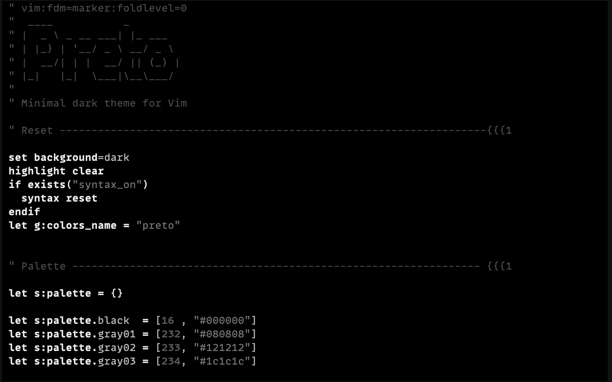
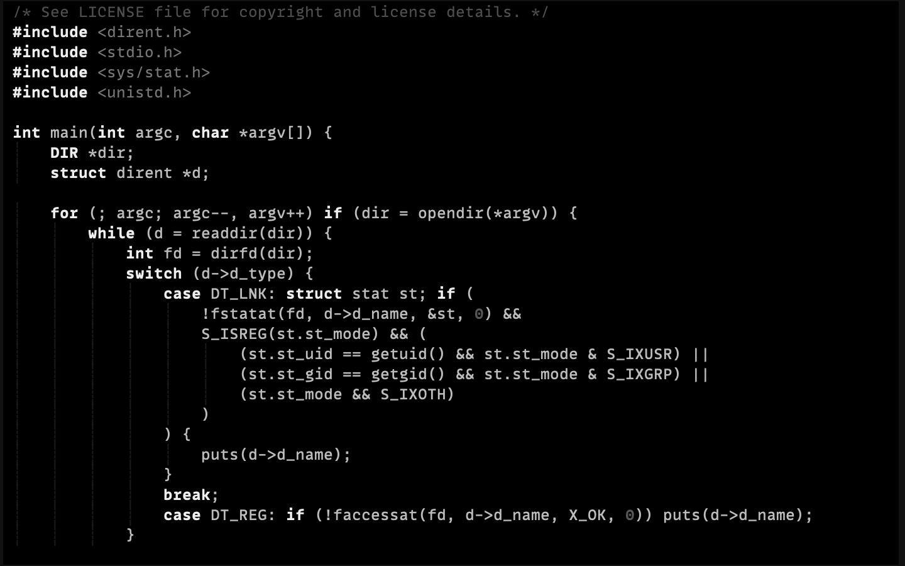
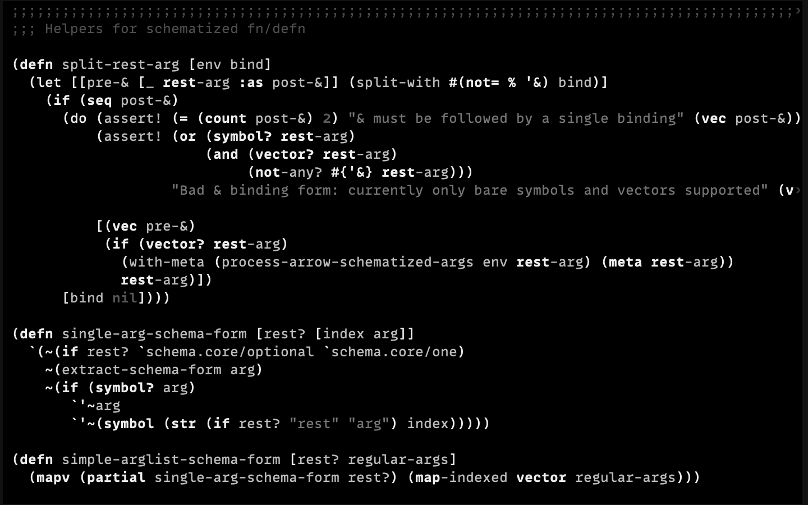
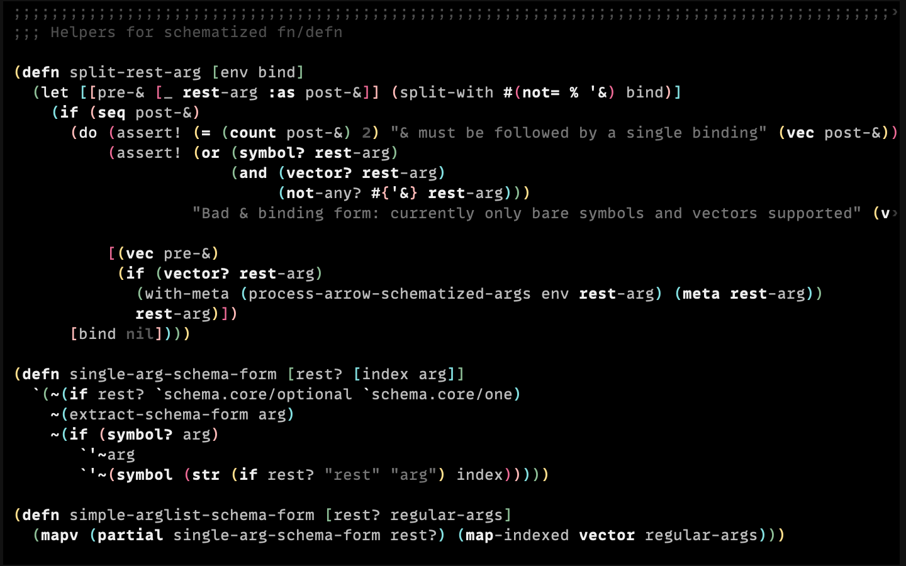
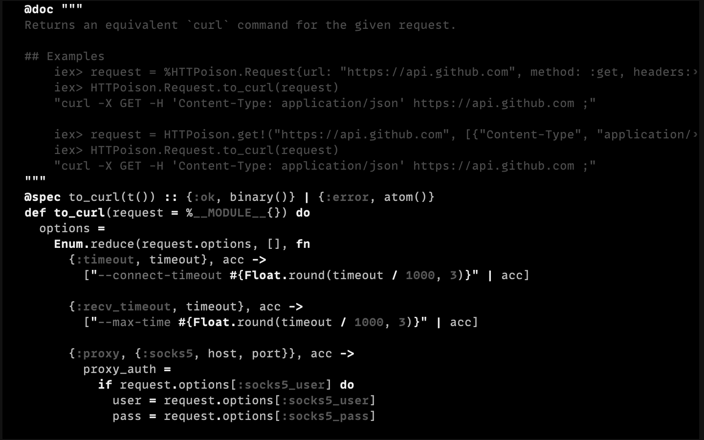
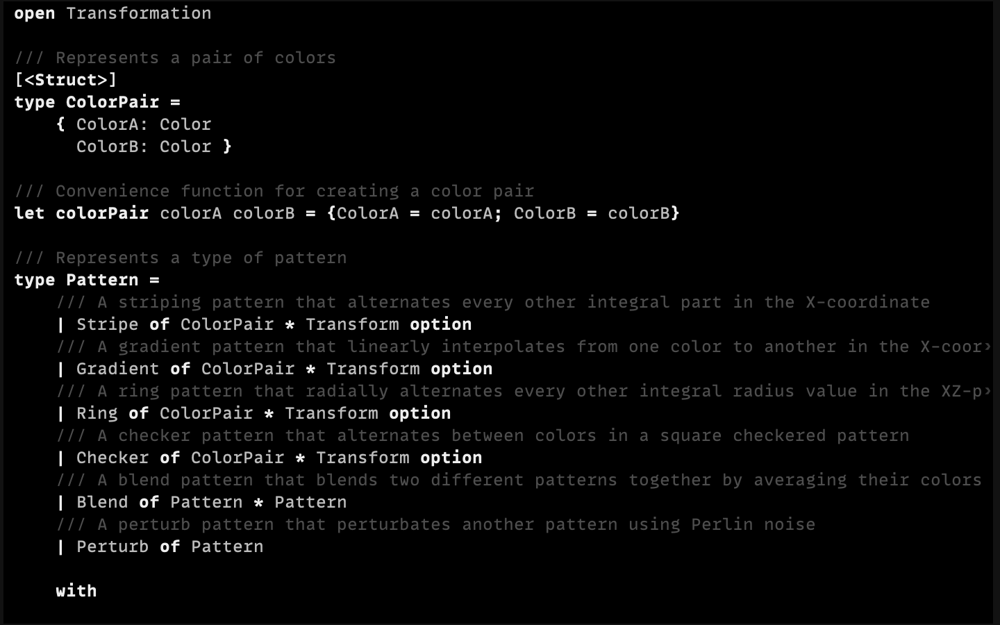
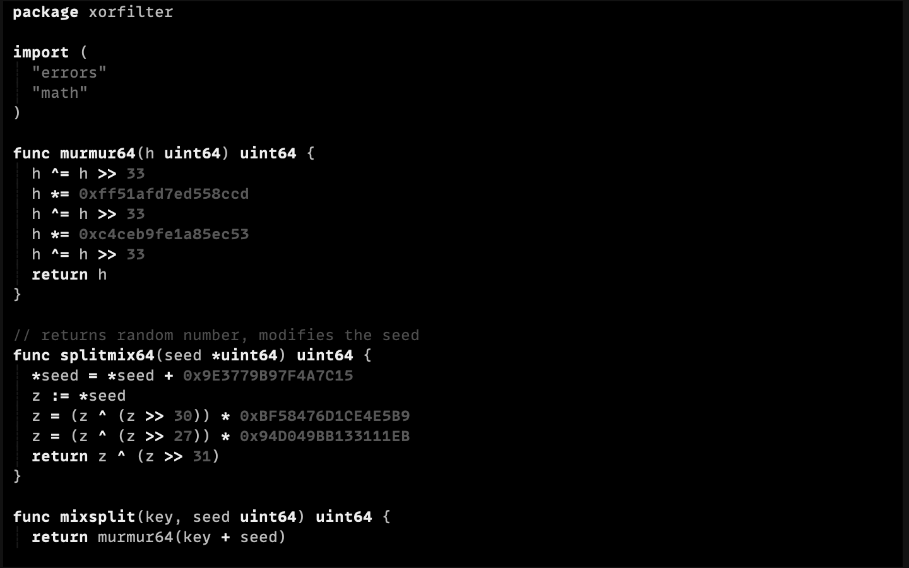
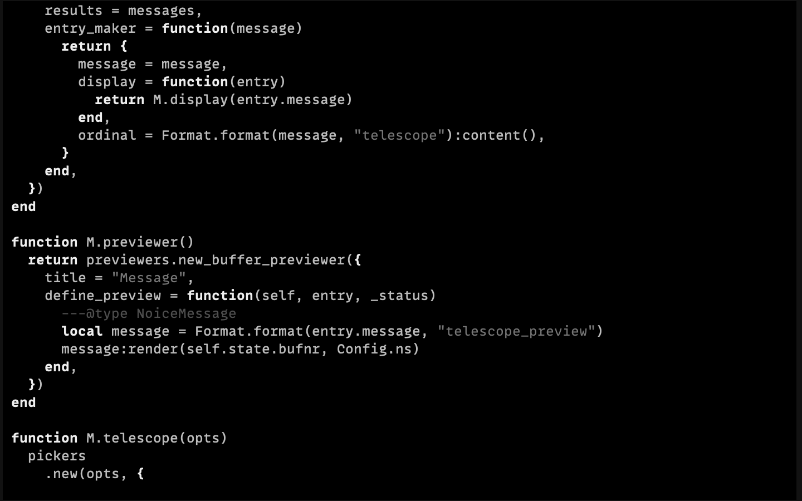
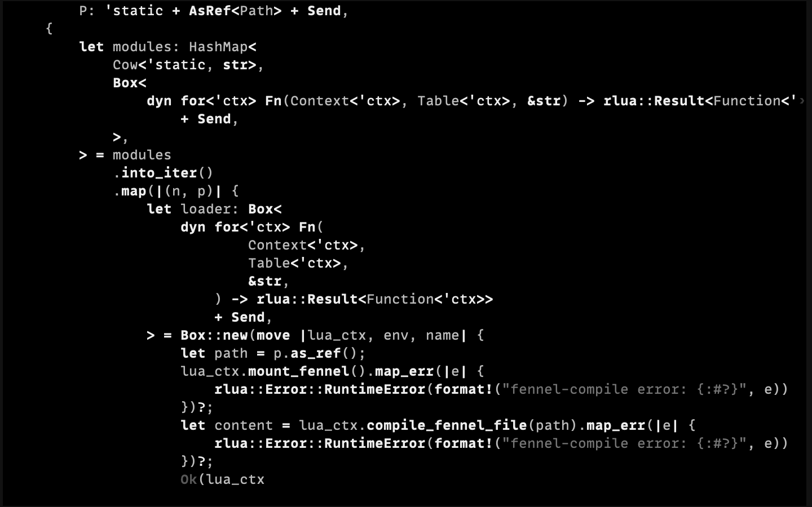
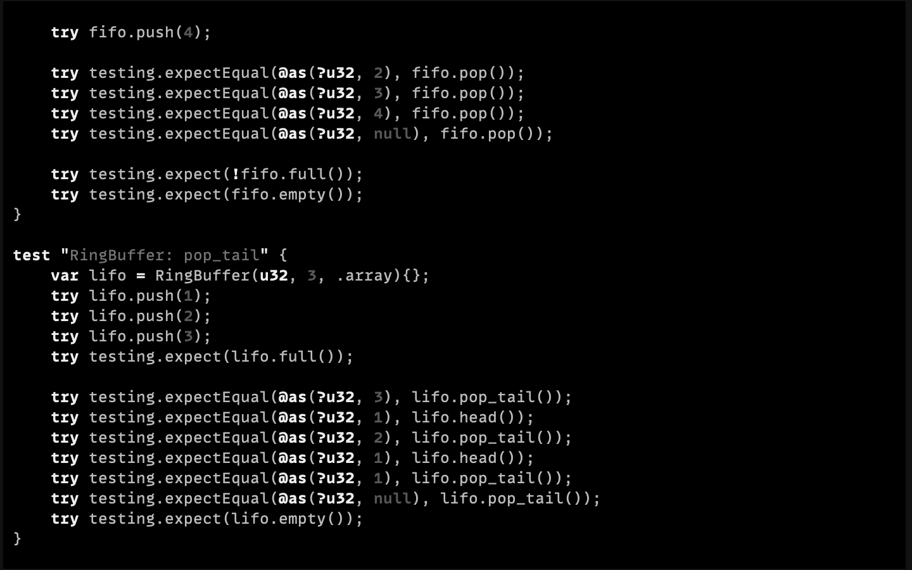

# Preto

> Minimal dark theme for Vim


## Examples

### Vim:



### C:



### Clojure:





### Elixir:



### F#:



### Go:



### Lua:



### Rust:



### Zig:



## Description

A fork of [ewilazarus/preto], lightly modified for readability and
congruency with [junegunn/seoul256.vim].

## Installation

```bash
# vim 8 package
git clone https://github.com/atweiden/preto.vim \
  "$HOME/.vim/pack/plugins/start/preto.vim"

# pathogen
git clone https://github.com/atweiden/preto.vim \
  "$HOME/.vim/bundle/preto.vim"
```

```vim
" plug
Plug 'atweiden/preto.vim'

" vundle
Plugin 'atweiden/preto.vim'

" dein.vim
call dein#add('atweiden/preto.vim')

" minpac
call minpac#add('atweiden/preto.vim')
```

## License

[Vim][LICENSE]


[ewilazarus/preto]: https://github.com/ewilazarus/preto
[junegunn/seoul256.vim]: https://github.com/junegunn/seoul256.vim
[LICENSE]: LICENSE
